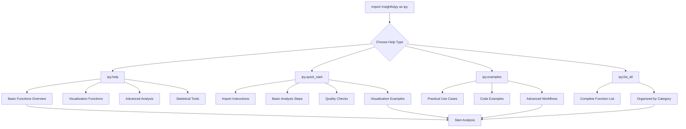
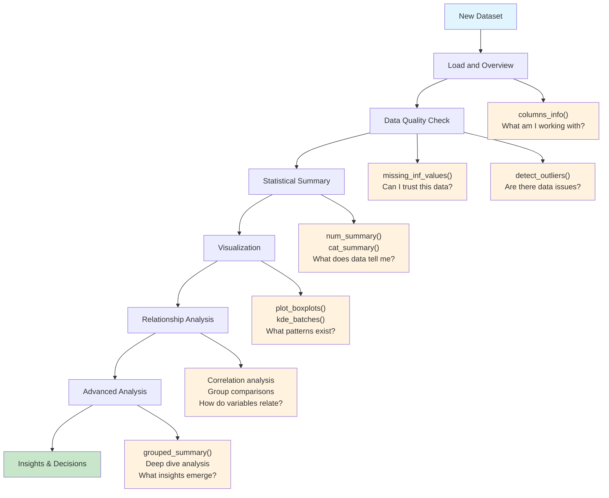
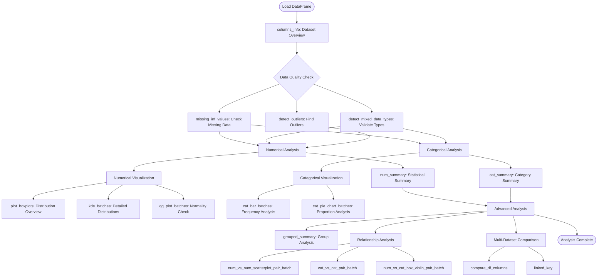
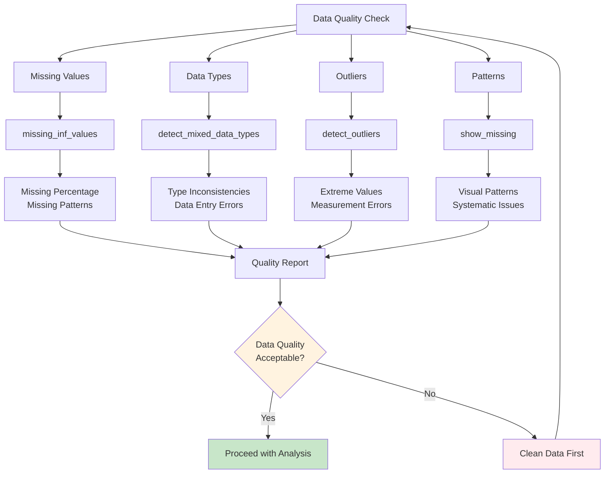
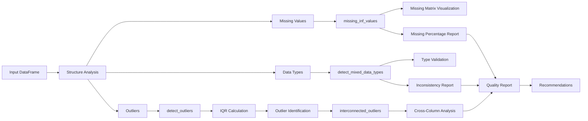
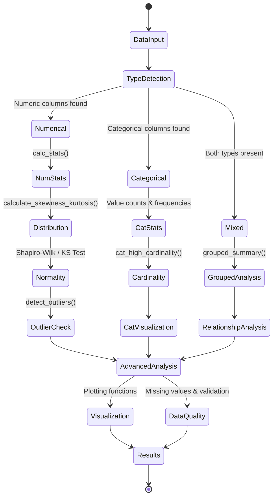
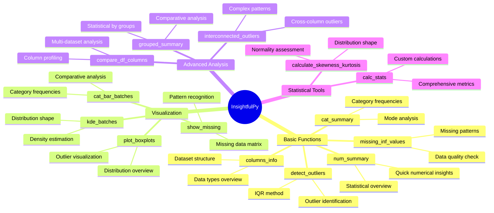
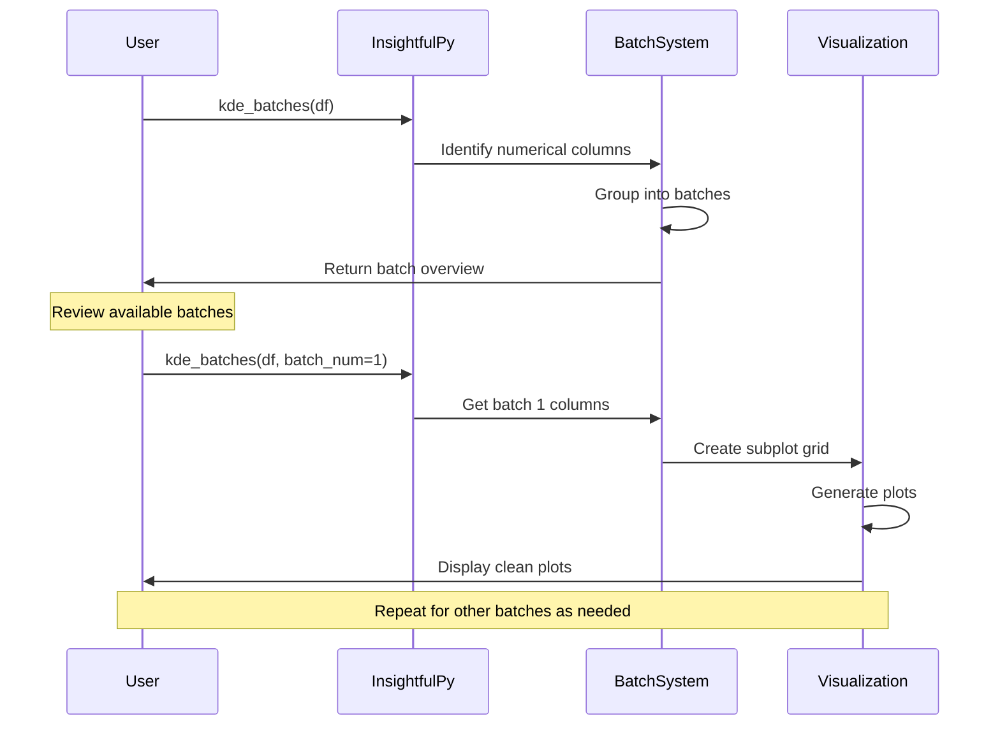

# InsightfulPy Diagram Gallery

> **Comprehensive visual documentation of InsightfulPy architecture, workflows, and processes**

---

## Package Architecture

### Main Package Structure

```mermaid
graph TD
    A[InsightfulPy v0.1.8]
    A --> B[Core EDA Module]
    
    B --> E[Statistical Analysis]
    E --> E1[calc_stats]
    E --> E2[calculate_skewness_kurtosis]
    E --> E3[iqr_trimmed_mean]
    E --> E4[mad]
    
    B --> F[Data Quality Assessment]
    F --> F1[detect_outliers]
    F --> F2[missing_inf_values]
    F --> F3[detect_mixed_data_types]
    F --> F4[interconnected_outliers]
    
    B --> G[Basic Visualization]
    G --> G1[show_missing]
    G --> G2[plot_boxplots]
    G --> G3[kde_batches]
    G --> G4[cat_bar_batches]
    G --> G5[cat_pie_chart_batches]
    
    B --> H[Summary Functions]
    H --> H1[num_summary]
    H --> H2[cat_summary]
    H --> H3[columns_info]
    H --> H4[grouped_summary]
    
    A --> D[Advanced Analysis]
    D --> I[Relationship Analysis]
    I --> I1[num_vs_num_scatterplot_pair_batch]
    I --> I2[cat_vs_cat_pair_batch]
    I --> I3[cat_high_cardinality]
    
    D --> J[Multi-Dataset Tools]
    J --> J1[compare_df_columns]
    J --> J2[linked_key]
    J --> J3[display_key_columns]
    
    D --> K[Batch Processing]
    K --> K1[Intelligent Batching]
    K --> K2[Memory Optimization]
    
    A --> C[Helper System]
    C --> C1[help]
    C --> C2[quick_start]
    C --> C3[examples]
    C --> C4[list_all]
    
    classDef mainNode fill:#2196F3,stroke:#1976D2,stroke-width:3px,color:#fff
    classDef coreModule fill:#E3F2FD,stroke:#1976D2,stroke-width:2px
    classDef statistical fill:#F3E5F5,stroke:#7B1FA2,stroke-width:2px
    classDef quality fill:#FFF3E0,stroke:#F57C00,stroke-width:2px
    classDef visualization fill:#E8F5E8,stroke:#388E3C,stroke-width:2px
    classDef advanced fill:#FCE4EC,stroke:#C2185B,stroke-width:2px
    classDef helper fill:#F1F8E9,stroke:#689F38,stroke-width:2px
    
    class A mainNode
    class B,C,D coreModule
    class E,H statistical
    class F quality
    class G visualization
    class I,J,K advanced
    class E1,E2,E3,E4,H1,H2,H3,H4 statistical
    class F1,F2,F3,F4 quality
    class G1,G2,G3,G4,G5 visualization
    class I1,I2,I3,J1,J2,J3,K1,K2 advanced
    class C1,C2,C3,C4 helper
```


*Complete package architecture showing all four main modules: Core EDA, Advanced Analysis, Helper System, and their respective functions*

---

## Help System Navigation

### Built-in Documentation Structure


*Interactive help system navigation flow for getting started with InsightfulPy*

---

## Analysis Workflows

### Recommended Data Analysis Workflow


*Systematic approach to data analysis from initial data loading through insights generation*

### Typical Analysis Workflow


*Detailed workflow showing the complete analysis process from data loading to final results*

---

## Data Quality Assessment Framework

### Quality Assessment Process


*Comprehensive data quality assessment framework with decision points*

### Data Quality Analysis Flow


*Detailed flow of data quality analysis processes and their interconnections*

---

## Statistical Analysis Process

### Statistical Analysis State Machine


*State machine representation of the statistical analysis process from data input to results*

---

## Function Organization

### Function Categories Mind Map


*Comprehensive mind map showing all function categories and their specific purposes*

---

## Batch Processing System

### Large Dataset Processing Flow


*Sequence diagram showing how batch processing handles large datasets efficiently*

---

## Usage Guidelines

### Function Selection Guide

| **Analysis Goal** | **Primary Functions** | **Visualization Functions** | **Advanced Functions** |
|:------------------|:---------------------|:----------------------------|:-----------------------|
| **Data Overview** | `columns_info()`, `num_summary()`, `cat_summary()` | `show_missing()` | `compare_df_columns()` |
| **Quality Check** | `missing_inf_values()`, `detect_outliers()` | `show_missing()`, `plot_boxplots()` | `interconnected_outliers()` |
| **Distribution Analysis** | `calculate_skewness_kurtosis()` | `kde_batches()`, `qq_plot_batches()` | `num_analysis_and_plot()` |
| **Categorical Analysis** | `cat_summary()` | `cat_bar_batches()`, `cat_pie_chart_batches()` | `cat_analyze_and_plot()` |
| **Relationship Analysis** | `grouped_summary()` | `num_vs_num_scatterplot_pair_batch()` | `cat_vs_cat_pair_batch()` |

### Complexity Levels

**Beginner Level:**
- `columns_info()` - Dataset overview
- `num_summary()` - Basic statistics
- `cat_summary()` - Category analysis
- `missing_inf_values()` - Data quality check

**Intermediate Level:**
- `kde_batches()` - Distribution analysis
- `plot_boxplots()` - Outlier visualization
- `grouped_summary()` - Comparative analysis
- `show_missing()` - Missing data patterns

**Advanced Level:**
- `interconnected_outliers()` - Complex outlier analysis
- `compare_df_columns()` - Multi-dataset comparison
- `num_vs_num_scatterplot_pair_batch()` - Relationship analysis
- Custom statistical calculations

---

## Integration Patterns

### Typical Import and Setup
```python
import pandas as pd
import insightfulpy as ipy

# Dataset loading
df = pd.read_csv('data.csv')

# Quick overview
ipy.columns_info('Dataset Name', df)

# Quality assessment
ipy.missing_inf_values(df, missing=True, inf=True)

# Statistical analysis
ipy.num_summary(df)
ipy.cat_summary(df)

# Visualization
ipy.plot_boxplots(df)
ipy.kde_batches(df, batch_num=1)
```

### Advanced Analysis Pattern
```python
# Advanced analysis workflow
outliers = ipy.detect_outliers(df)
interconnected = ipy.interconnected_outliers(df, outlier_cols)
grouped_analysis = ipy.grouped_summary(df, groupby='category')

# Multi-dataset comparison
comparison = ipy.compare_df_columns('base', {
    'dataset1': df1,
    'dataset2': df2
})
```

---

**Package Information:**

**Version:** 0.1.8 | **Author:** Dhanesh B. B. | **License:** MIT | **Python:** 3.8+

---

*All diagrams represent the comprehensive architecture and workflows of **InsightfulPy** - EDA toolkit for comprehensive data analysis*
