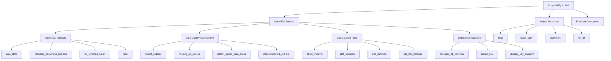
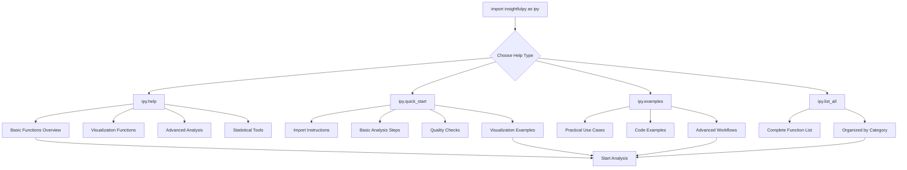
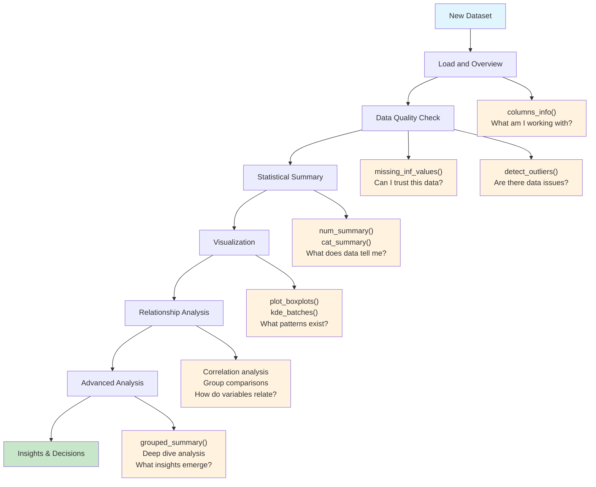
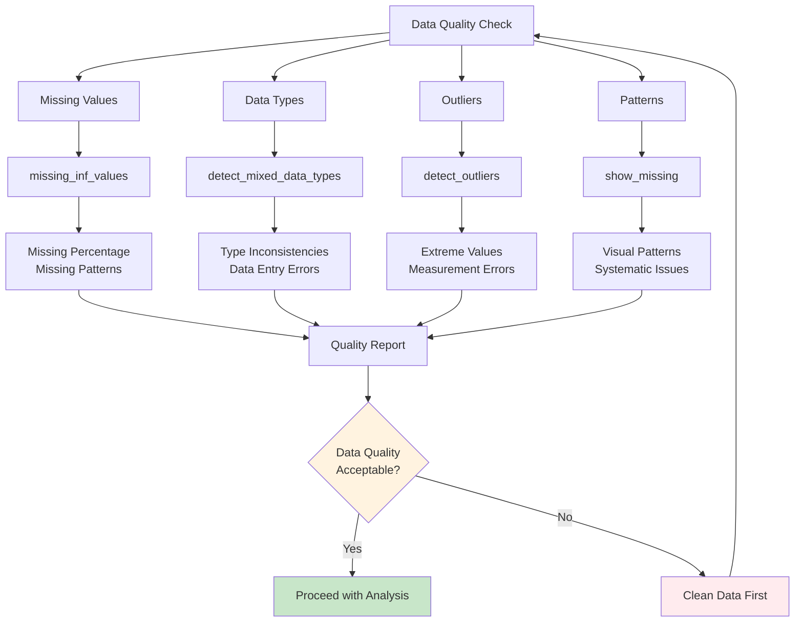
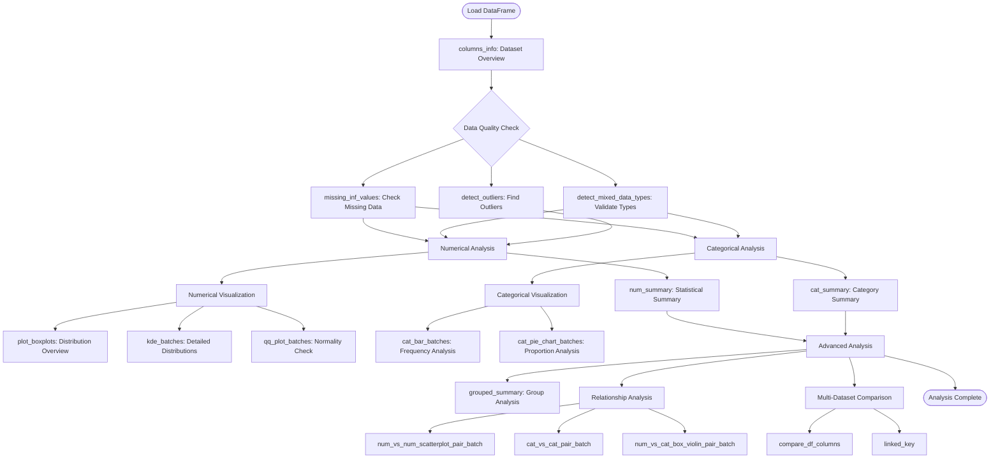
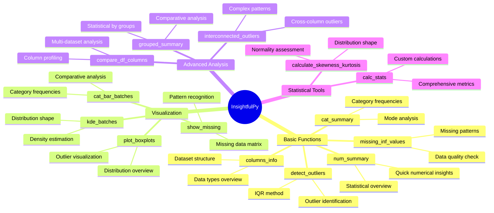
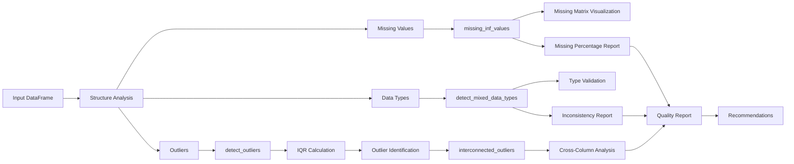
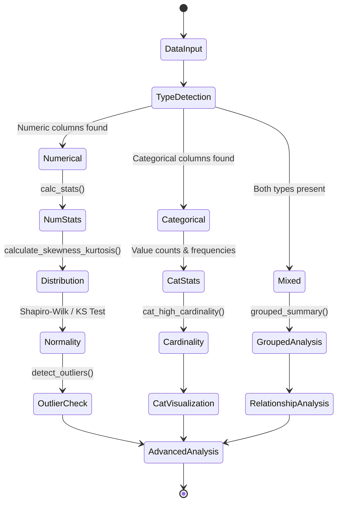

# InsightfulPy Documentation

## Table of Contents

1. [Overview](#overview)
2. [Installation](#installation)
3. [Quick Start](#quick-start)
4. [User Guide](#user-guide)
5. [API Reference](#api-reference)
6. [Contributing](#contributing)

---

## Overview

InsightfulPy is a comprehensive Python package for exploratory data analysis (EDA) designed to streamline the data analysis workflow. The package provides a complete suite of tools for data quality assessment, statistical analysis, and visualization, enabling users to quickly understand and explore their datasets.

### Key Features

- **Data Quality Assessment**: Comprehensive tools for identifying missing values, outliers, and data type inconsistencies
- **Statistical Analysis**: Complete descriptive statistics, distribution analysis, and grouped summaries
- **Intelligent Visualization**: Automated plot generation with batch processing for large datasets
- **Advanced Analytics**: Multi-dataset comparison, relationship analysis, and cross-column outlier detection
- **Built-in Documentation**: Comprehensive help system with practical examples

### Package Architecture

The package is organized into four main functional categories:



- **Basic Analysis Functions**: Core statistical and structural analysis tools
- **Data Quality Functions**: Tools for assessing and validating data integrity
- **Visualization Functions**: Comprehensive plotting and charting capabilities
- **Advanced Analysis Functions**: Complex analytics and multi-dataset operations

### System Requirements

- Python 3.8 or higher
- 64-bit operating system (recommended)
- Minimum 512 MB RAM (2 GB recommended for large datasets)

---

## Installation

### Standard Installation

```bash
pip install insightfulpy
```

### Development Installation

For contributors or users requiring the latest development version:

```bash
git clone https://github.com/dhaneshbb/insightfulpy.git
cd insightfulpy
pip install -e ".[dev]"
```

### Dependencies

The package automatically installs the following required dependencies:

- pandas (>=1.3.0) - Data manipulation and analysis
- numpy (>=1.20.0) - Numerical computing
- matplotlib (>=3.3.0) - Basic plotting functionality
- seaborn (>=0.11.0) - Statistical data visualization
- scipy (>=1.7.0) - Scientific computing and statistical functions
- researchpy (>=0.3.0) - Research-oriented statistical tools
- tableone (>=0.7.0) - Summary table generation
- missingno (>=0.5.0) - Missing data visualization
- tabulate (>=0.8.0) - Table formatting utilities

### Installation Verification

After installation, verify the package is working correctly:

```python
import insightfulpy as ipy
import pandas as pd

# Check version
print(f"InsightfulPy version: {ipy.__version__}")

# Create test dataset
test_data = {
    'numeric_column': [1, 2, 3, 4, 5, 100],
    'categorical_column': ['A', 'B', 'A', 'B', 'A', 'C']
}
df = pd.DataFrame(test_data)

# Test basic functionality
ipy.columns_info('Test Dataset', df)
print(ipy.num_summary(df))
print(ipy.cat_summary(df))
```

---

## Quick Start

### Basic Workflow

```python
import pandas as pd
import insightfulpy as ipy

# Load dataset
df = pd.read_csv('your_data.csv')

# Step 1: Dataset Overview
ipy.columns_info('Dataset Name', df)

# Step 2: Data Quality Assessment
ipy.missing_inf_values(df, missing=True, inf=True)
ipy.detect_outliers(df)

# Step 3: Statistical Analysis
numerical_summary = ipy.num_summary(df)
categorical_summary = ipy.cat_summary(df)

# Step 4: Visualization
ipy.show_missing(df)
ipy.plot_boxplots(df)
ipy.kde_batches(df, batch_num=1)

# Step 5: Advanced Analysis
grouped_analysis = ipy.grouped_summary(df, groupby='category_column')
```

### Help System

InsightfulPy includes a comprehensive built-in help system:



```python
# Function overview
ipy.help()

# Step-by-step tutorial
ipy.quick_start()

# Practical examples
ipy.examples()

# Complete function list
ipy.list_all()
```

---

## User Guide

### Data Analysis Workflow

The recommended approach for data analysis using InsightfulPy follows a systematic workflow:



1. **Load and Overview** - What am I working with?
2. **Data Quality Check** - Can I trust this data?
3. **Statistical Summary** - What does the data tell me?
4. **Visualization** - What patterns can I see?
5. **Relationship Analysis** - How do variables relate to each other?
6. **Advanced Analysis** - What deeper insights can I find?

### Step 1: Data Loading and Overview

Begin every analysis by understanding the dataset structure:

```python
# Load data
df = pd.read_csv('dataset.csv')

# Get comprehensive dataset overview
ipy.columns_info('Dataset Title', df)
```

The `columns_info` function provides:
- Row and column counts
- Data type information
- Value ranges for numerical data
- Unique value counts for categorical data
- Memory usage statistics

### Step 2: Data Quality Assessment

Assess data integrity before proceeding with analysis:



```python
# Check for missing and infinite values
ipy.missing_inf_values(df, missing=True, inf=True)

# Visualize missing data patterns
ipy.show_missing(df)

# Identify data type inconsistencies
ipy.detect_mixed_data_types(df)

# Detect statistical outliers
outliers = ipy.detect_outliers(df)
```

**Quality Assessment Criteria:**
- Missing values exceeding 20% require special attention
- Systematic missing data patterns may indicate collection issues
- Mixed data types often signal data entry problems
- Excessive outliers may indicate measurement errors

### Step 3: Statistical Summary Analysis

Generate comprehensive statistical summaries:

```python
# Numerical data analysis
numerical_stats = ipy.num_summary(df)

# Categorical data analysis
categorical_stats = ipy.cat_summary(df)

# Distribution characteristics
distribution_stats = ipy.calculate_skewness_kurtosis(df)
```

**Key Statistical Indicators:**
- Mean vs. median differences indicate skewness
- Standard deviation shows data dispersion
- Skewness values >1 or <-1 indicate highly skewed distributions
- Kurtosis values >3 suggest heavy-tailed distributions

### Step 4: Visualization and Pattern Recognition

Create visualizations to identify patterns and distributions:

```python
# Distribution overview with box plots
ipy.plot_boxplots(df)

# Detailed distribution analysis
batches = ipy.kde_batches(df)  # View available batches
ipy.kde_batches(df, batch_num=1)  # Plot specific batch

# Categorical data visualization
cat_batches = ipy.cat_bar_batches(df)
ipy.cat_bar_batches(df, batch_num=1)

# Normality assessment
ipy.qq_plot_batches(df, batch_num=1)
```

**Visualization Best Practices:**
- Start with box plots for distribution overview
- Use KDE plots for detailed shape analysis
- Process visualizations in batches for clarity
- Assess normality before applying parametric tests

### Step 5: Relationship Analysis

Explore relationships between variables:

```python
# Numerical variable relationships
num_pairs = ipy.num_vs_num_scatterplot_pair_batch(df)
ipy.num_vs_num_scatterplot_pair_batch(df, pair_num=0, batch_num=1)

# Categorical variable relationships
cat_pairs = ipy.cat_vs_cat_pair_batch(df)
ipy.cat_vs_cat_pair_batch(df, pair_num=0, batch_num=1)

# Mixed variable type analysis
mixed_pairs = ipy.num_vs_cat_box_violin_pair_batch(df)
ipy.num_vs_cat_box_violin_pair_batch(df, pair_num=0, batch_num=1)
```

### Step 6: Advanced Analytics

Perform sophisticated analysis techniques:

```python
# Grouped statistical analysis
grouped_summary = ipy.grouped_summary(df, groupby='target_variable')

# Individual column deep-dive
ipy.num_analysis_and_plot(df, 'column_name', target='group_variable')
ipy.cat_analyze_and_plot(df, 'category_column', target='outcome_variable')

# Cross-column outlier detection
interconnected = ipy.interconnected_outliers(df, outlier_columns)

# Multi-dataset comparison
comparison = ipy.compare_df_columns('primary_dataset', {
    'dataset1': df1,
    'dataset2': df2
})
```

### Working with Large Datasets

For datasets exceeding memory constraints or requiring performance optimization:

```mermaid
sequenceDiagram
    participant User
    participant InsightfulPy
    participant BatchSystem
    participant Visualization
    
    User->>InsightfulPy: kde_batches(df)
    InsightfulPy->>BatchSystem: Identify numerical columns
    BatchSystem->>BatchSystem: Group into batches
    BatchSystem->>User: Return batch overview
    
    Note over User: Review available batches
    
    User->>InsightfulPy: kde_batches(df, batch_num=1)
    InsightfulPy->>BatchSystem: Get batch 1 columns
    BatchSystem->>Visualization: Create subplot grid
    Visualization->>Visualization: Generate plots
    Visualization->>User: Display clean plots
    
    Note over User, Visualization: Repeat for other batches as needed
```



#### Sampling Strategies

```python
# Random sampling for initial exploration
sample_df = df.sample(n=10000, random_state=42)
ipy.num_summary(sample_df)

# Stratified sampling for categorical balance
stratified_sample = df.groupby('category_column').apply(
    lambda x: x.sample(min(len(x), 1000))
).reset_index(drop=True)
```

#### Batch Processing

```python
# Process visualizations in manageable batches
total_batches = ipy.kde_batches(df)
for batch_num in range(1, len(total_batches) + 1):
    print(f"Processing batch {batch_num}")
    ipy.kde_batches(df, batch_num=batch_num)
```

#### Memory Optimization

```python
# Optimize data types
df['categorical_column'] = df['categorical_column'].astype('category')
df['integer_column'] = df['integer_column'].astype('int32')

# Monitor memory usage
print(df.memory_usage(deep=True))
```

### Typical Workflow

Most analyses follow this general pattern:



### Function Categories



### Data Quality Assessment



### Statistical Analysis



### Data Type Handling

#### Numerical Data Analysis

```python
# Comprehensive numerical analysis
ipy.num_analysis_and_plot(df, 'price_column', visualize=True)

# Group comparison
ipy.num_analysis_and_plot(df, 'metric_column', target='category_column')

# Custom statistical calculations
custom_stats = ipy.calc_stats(df['variable'])
```

#### Categorical Data Analysis

```python
# Basic categorical analysis
ipy.cat_analyze_and_plot(df, 'region_column')

# Cross-tabulation analysis
ipy.cat_analyze_and_plot(df, 'primary_category', target='outcome_category')

# High cardinality handling
ipy.cat_bar_batches(df, high_cardinality_limit=15, show_high_cardinality=True)
```

### Troubleshooting Common Issues

#### Memory Errors
- Use data sampling for initial exploration
- Process visualizations in smaller batches
- Optimize data types before analysis

#### Visualization Clarity
- Limit high cardinality categories in plots
- Use batch processing for multiple variables
- Adjust figure sizes for better readability

#### Performance Optimization
- Focus analysis on relevant columns
- Use appropriate sampling techniques
- Monitor system resources during processing

---

## API Reference

### Basic Analysis Functions

#### `num_summary(data)`

Generate comprehensive statistical summary for numerical columns.

**Parameters:**
- `data` (pandas.DataFrame): Input DataFrame containing numerical columns

**Returns:**
- `pandas.DataFrame`: Statistical summary including count, mean, standard deviation, quartiles, skewness, and kurtosis

**Example:**
```python
summary = ipy.num_summary(df)
```

#### `cat_summary(data)`

Generate frequency analysis for categorical columns.

**Parameters:**
- `data` (pandas.DataFrame): Input DataFrame containing categorical columns

**Returns:**
- `pandas.DataFrame`: Summary with count, unique values, mode, and top frequency

**Example:**
```python
categorical_summary = ipy.cat_summary(df)
```

#### `columns_info(title, data)`

Display comprehensive dataset structure information.

**Parameters:**
- `title` (str): Descriptive title for the dataset
- `data` (pandas.DataFrame): Input DataFrame

**Output:**
- Formatted table displaying column information, data types, value ranges, and distinct counts

**Example:**
```python
ipy.columns_info('Sales Data Analysis', df)
```

#### `missing_inf_values(df, missing=False, inf=False, df_table=False)`

Analyze missing and infinite values in the dataset.

**Parameters:**
- `df` (pandas.DataFrame): Input DataFrame
- `missing` (bool, optional): Include missing value analysis. Default: False
- `inf` (bool, optional): Include infinite value analysis. Default: False
- `df_table` (bool, optional): Return results as DataFrame. Default: False

**Returns:**
- `pandas.DataFrame` (if df_table=True): Summary of missing and infinite values
- `None` (if df_table=False): Prints formatted results

**Example:**
```python
# Print results
ipy.missing_inf_values(df, missing=True, inf=True)

# Get DataFrame results
missing_analysis = ipy.missing_inf_values(df, missing=True, df_table=True)
```

#### `detect_outliers(data, max_display=10)`

Detect outliers using the Interquartile Range (IQR) method.

**Parameters:**
- `data` (pandas.DataFrame): Input DataFrame with numerical columns
- `max_display` (int, optional): Maximum number of outlier values to display. Default: 10

**Returns:**
- `pandas.DataFrame`: Outlier analysis with bounds, counts, and percentages

**Example:**
```python
outlier_analysis = ipy.detect_outliers(df)
```

### Data Quality Functions

#### `detect_mixed_data_types(data)`

Identify columns containing mixed data types.

**Parameters:**
- `data` (pandas.DataFrame): Input DataFrame

**Output:**
- Formatted table showing columns with mixed data types

**Example:**
```python
ipy.detect_mixed_data_types(df)
```

#### `interconnected_outliers(df, outlier_cols)`

Analyze outliers occurring across multiple columns simultaneously.

**Parameters:**
- `df` (pandas.DataFrame): Input DataFrame
- `outlier_cols` (list): List of column names to analyze for interconnected outliers

**Returns:**
- `pandas.DataFrame`: Rows containing outliers in multiple specified columns

**Example:**
```python
interconnected = ipy.interconnected_outliers(df, ['price', 'quantity', 'discount'])
```

### Visualization Functions

#### `show_missing(data)`

Visualize missing data patterns using matrix and bar charts.

**Parameters:**
- `data` (pandas.DataFrame): Input DataFrame

**Output:**
- Missing value matrix visualization and summary bar chart

**Example:**
```python
ipy.show_missing(df)
```

#### `plot_boxplots(df)`

Generate box plots for all numerical columns.

**Parameters:**
- `df` (pandas.DataFrame): Input DataFrame

**Output:**
- Grid layout of box plots showing distributions and outliers

**Example:**
```python
ipy.plot_boxplots(df)
```

#### `kde_batches(data, batch_num=None)`

Generate Kernel Density Estimation plots in organized batches.

**Parameters:**
- `data` (pandas.DataFrame): Input DataFrame
- `batch_num` (int, optional): Specific batch number to plot

**Returns:**
- `pandas.DataFrame` (if batch_num=None): Available batch information
- `None` (if batch_num specified): Displays KDE plots for the specified batch

**Example:**
```python
# View available batches
batches = ipy.kde_batches(df)

# Plot specific batch
ipy.kde_batches(df, batch_num=1)
```

#### `box_plot_batches(data, batch_num=None)`

Generate box plots in organized batches for numerical columns.

**Parameters:**
- `data` (pandas.DataFrame): Input DataFrame
- `batch_num` (int, optional): Specific batch number to plot

**Example:**
```python
ipy.box_plot_batches(df, batch_num=1)
```

#### `qq_plot_batches(data, batch_num=None)`

Generate Quantile-Quantile plots for normality assessment.

**Parameters:**
- `data` (pandas.DataFrame): Input DataFrame
- `batch_num` (int, optional): Specific batch number to plot

**Example:**
```python
ipy.qq_plot_batches(df, batch_num=1)
```

#### `cat_bar_batches(data, batch_num=None, high_cardinality_limit=19, show_high_cardinality=True, show_percentage=None)`

Generate bar charts for categorical columns in organized batches.

**Parameters:**
- `data` (pandas.DataFrame): Input DataFrame
- `batch_num` (int, optional): Specific batch number to plot
- `high_cardinality_limit` (int, optional): Threshold for high cardinality categories. Default: 19
- `show_high_cardinality` (bool, optional): Include high cardinality columns. Default: True
- `show_percentage` (bool, optional): Display percentages on bars

**Example:**
```python
# View available batches
batches = ipy.cat_bar_batches(df)

# Plot specific batch with customization
ipy.cat_bar_batches(df, batch_num=1, high_cardinality_limit=15)
```

#### `cat_pie_chart_batches(data, batch_num=None, high_cardinality_limit=20)`

Generate pie charts for categorical columns in organized batches.

**Parameters:**
- `data` (pandas.DataFrame): Input DataFrame
- `batch_num` (int, optional): Specific batch number to plot
- `high_cardinality_limit` (int, optional): Threshold for high cardinality categories. Default: 20

### Advanced Analysis Functions

#### `grouped_summary(data, groupby=None)`

Generate summary statistics grouped by categorical variables.

**Parameters:**
- `data` (pandas.DataFrame): Input DataFrame
- `groupby` (str, optional): Column name for grouping

**Returns:**
- `tableone.TableOne`: Grouped summary statistics object

**Example:**
```python
grouped_analysis = ipy.grouped_summary(df, groupby='category')
print(grouped_analysis)
```

#### `compare_df_columns(base_df_name, dataframes)`

Compare column characteristics across multiple DataFrames.

**Parameters:**
- `base_df_name` (str): Name identifier for the base DataFrame
- `dataframes` (dict): Dictionary mapping DataFrame names to DataFrame objects

**Returns:**
- `tuple`: (base_profile, linked_profiles) containing comparison results

**Example:**
```python
comparison = ipy.compare_df_columns('primary', {
    'dataset1': df1,
    'dataset2': df2,
    'dataset3': df3
})
```

#### `num_vs_num_scatterplot_pair_batch(data_copy, pair_num=None, batch_num=None, hue_column=None)`

Generate scatter plots for numerical variable relationships in batches.

**Parameters:**
- `data_copy` (pandas.DataFrame): Input DataFrame
- `pair_num` (int, optional): Primary variable index for pairing
- `batch_num` (int, optional): Batch number to process
- `hue_column` (str, optional): Column name for color coding points

**Example:**
```python
# View available pairs
pairs = ipy.num_vs_num_scatterplot_pair_batch(df)

# Generate specific scatter plot batch
ipy.num_vs_num_scatterplot_pair_batch(df, pair_num=0, batch_num=1)
```

#### `cat_vs_cat_pair_batch(data_copy, pair_num=None, batch_num=None, high_cardinality_limit=19, show_high_cardinality=True)`

Generate heatmaps for categorical variable relationships.

**Parameters:**
- `data_copy` (pandas.DataFrame): Input DataFrame
- `pair_num` (int, optional): Primary variable index for pairing
- `batch_num` (int, optional): Batch number to process
- `high_cardinality_limit` (int, optional): Threshold for high cardinality categories. Default: 19
- `show_high_cardinality` (bool, optional): Include high cardinality columns. Default: True

#### `num_vs_cat_box_violin_pair_batch(data_copy, pair_num=None, batch_num=None, high_cardinality_limit=20, show_high_cardinality=True)`

Generate combined box and violin plots for numerical vs categorical analysis.

**Parameters:**
- `data_copy` (pandas.DataFrame): Input DataFrame
- `pair_num` (int, optional): Numerical variable index
- `batch_num` (int, optional): Batch number to process
- `high_cardinality_limit` (int, optional): Threshold for high cardinality categories. Default: 20
- `show_high_cardinality` (bool, optional): Include high cardinality columns. Default: True

### Statistical Functions

#### `calc_stats(data)`

Calculate comprehensive statistics for a pandas Series.

**Parameters:**
- `data` (pandas.Series): Input Series for statistical calculation

**Returns:**
- `dict`: Dictionary containing comprehensive statistical measures

**Calculated Statistics:**
- Count, Mean, Trimmed Mean, Mean Absolute Deviation
- Standard Deviation, Variance
- Minimum, 25th Percentile, Median, 75th Percentile, Maximum
- Mode, Range, Interquartile Range
- Skewness, Kurtosis

**Example:**
```python
statistics = ipy.calc_stats(df['numerical_column'])
```

#### `calculate_skewness_kurtosis(data)`

Calculate skewness and kurtosis for all numerical columns.

**Parameters:**
- `data` (pandas.DataFrame): Input DataFrame

**Returns:**
- `pandas.DataFrame`: Skewness and kurtosis values for each numerical column

**Example:**
```python
distribution_metrics = ipy.calculate_skewness_kurtosis(df)
```

#### `iqr_trimmed_mean(data)`

Calculate mean after removing outliers using the IQR method.

**Parameters:**
- `data` (pandas.Series): Input Series

**Returns:**
- `float`: Trimmed mean value after outlier removal

**Example:**
```python
trimmed_mean = ipy.iqr_trimmed_mean(df['price'])
```

#### `mad(data)`

Calculate Mean Absolute Deviation.

**Parameters:**
- `data` (pandas.Series): Input Series

**Returns:**
- `float`: Mean Absolute Deviation value

**Example:**
```python
deviation = ipy.mad(df['values'])
```

### Individual Analysis Functions

#### `num_analysis_and_plot(data, attr, target=None, visualize=True, subplot=True, show_table=True, target_vis=True, return_df=None)`

Comprehensive analysis and visualization for a single numerical attribute.

**Parameters:**
- `data` (pandas.DataFrame): Input DataFrame
- `attr` (str): Column name to analyze
- `target` (str, optional): Target variable for grouping analysis
- `visualize` (bool, optional): Generate visualizations. Default: True
- `subplot` (bool, optional): Use subplot layouts. Default: True
- `show_table` (bool, optional): Display statistical tables. Default: True
- `target_vis` (bool, optional): Include target-based visualizations. Default: True
- `return_df` (optional): Return results as DataFrame

**Example:**
```python
ipy.num_analysis_and_plot(df, 'price', target='category')
```

#### `cat_analyze_and_plot(data, attribute, target=None, visualize=True, target_vis=True, show_table=True, subplot=True, return_df=None)`

Comprehensive analysis and visualization for a single categorical attribute.

**Parameters:**
- `data` (pandas.DataFrame): Input DataFrame
- `attribute` (str): Column name to analyze
- `target` (str, optional): Target variable for comparison
- `visualize` (bool, optional): Generate visualizations. Default: True
- `target_vis` (bool, optional): Include target-based visualizations. Default: True
- `show_table` (bool, optional): Display frequency tables. Default: True
- `subplot` (bool, optional): Use subplot layouts. Default: True
- `return_df` (optional): Return results as DataFrame

**Example:**
```python
ipy.cat_analyze_and_plot(df, 'region', target='sales_performance')
```

### Helper Functions

#### `help()`

Display comprehensive function overview organized by categories.

**Output:**
- Formatted help text with function descriptions and usage categories

#### `quick_start()`

Display step-by-step tutorial with practical examples.

**Output:**
- Getting started guide with code examples

#### `examples()`

Display practical usage examples for common analysis scenarios.

**Output:**
- Real-world code examples and workflows

#### `list_all()`

List all available functions organized by functional categories.

**Returns:**
- `list`: Complete list of available function names

**Output:**
- Categorized function listing

---

## Contributing

### Development Setup

1. Fork the repository on GitHub
2. Clone your fork locally:
   ```bash
   git clone https://github.com/dhaneshbb/insightfulpy.git
   cd insightfulpy
   ```
3. Install development dependencies:
   ```bash
   pip install -e ".[dev]"
   ```

### Code Standards

- Follow PEP 8 style guidelines
- Include comprehensive docstrings for all functions
- Write unit tests for new functionality
- Maintain backward compatibility when possible

### Testing

Run the test suite before submitting contributions:

```bash
pytest tests/
```

### Documentation

- Update relevant documentation for new features
- Include practical examples in docstrings
- Follow established documentation formatting

### Submitting Changes

1. Create a feature branch for your changes
2. Make your modifications with appropriate tests
3. Update documentation as needed
4. Submit a pull request with detailed description

### Reporting Issues

Report bugs or request features through the GitHub issue tracker:
- Provide minimal reproducible examples
- Include system information and package versions
- Describe expected vs. actual behavior

### License

InsightfulPy is distributed under the MIT License. All contributions are subject to the same license terms.

---

**Package Information:**
- Version: 0.1.8
- Author: Dhanesh B. B.
- Repository: https://github.com/dhaneshbb/insightfulpy
- License: MIT
- Python Support: 3.8+

