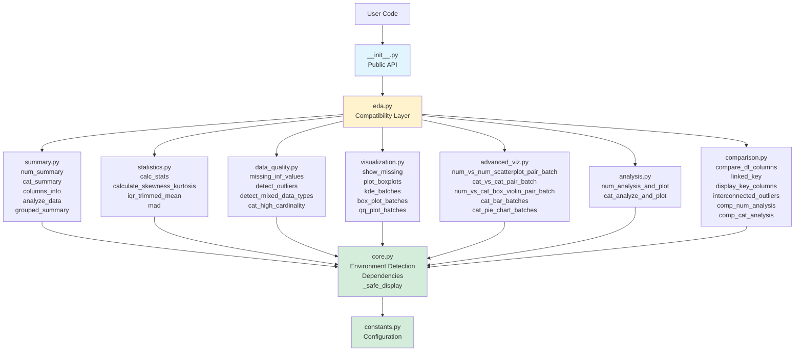
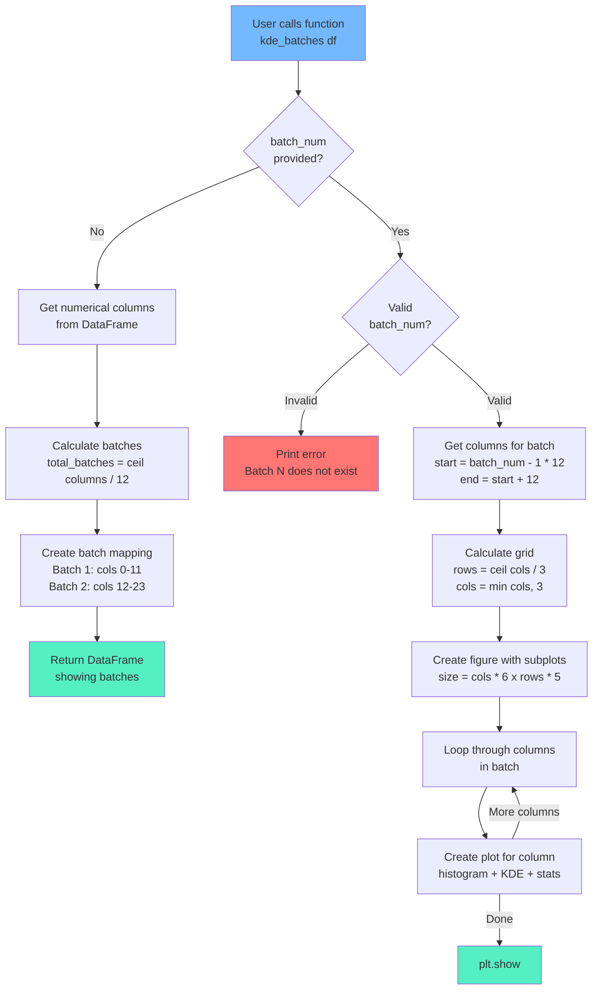
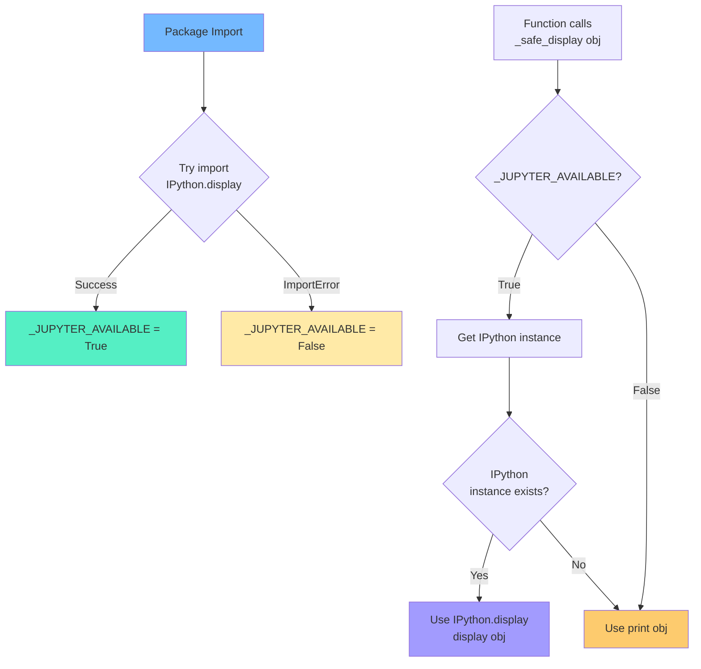
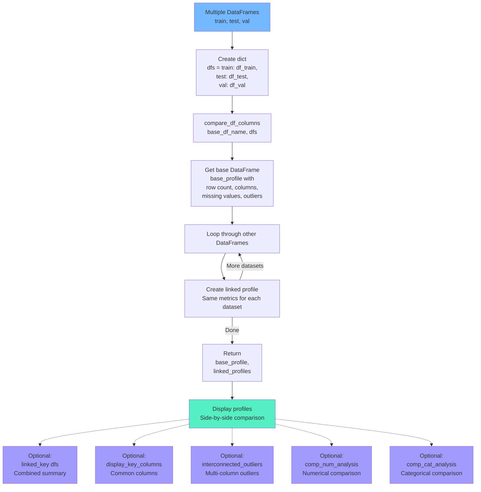

# InsightfulPy Architecture Diagrams

Visual documentation of system architecture, workflows, and module relationships.

## Table of Contents

- [Module Architecture](#module-architecture)
- [Batch Processing Workflow](#batch-processing-workflow)
- [Environment Detection Flow](#environment-detection-flow)
- [Multi-Dataset Comparison Flow](#multi-dataset-comparison-flow)

---

## Module Architecture

The modular architecture with backward compatibility layer.

---

## Batch Processing Workflow

How batch visualization functions work.

---

## Environment Detection Flow

How InsightfulPy adapts to Jupyter vs terminal environments.

---

## Multi-Dataset Comparison Flow

Workflow for comparing multiple datasets.

---

## See Also

- [Developer Guide](developer-guide.md) - Architecture details

---

Version: 0.2.0 | Status: Beta | Python: 3.8-3.12

Copyright 2025 dhaneshbb | License: MIT | Homepage: https://github.com/dhaneshbb/insightfulpy
