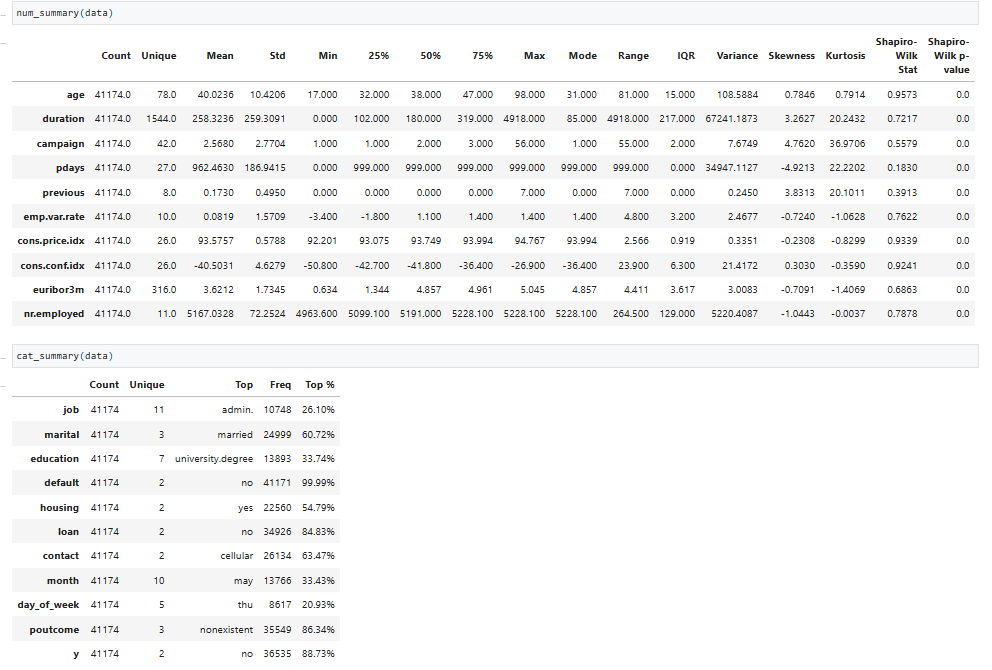
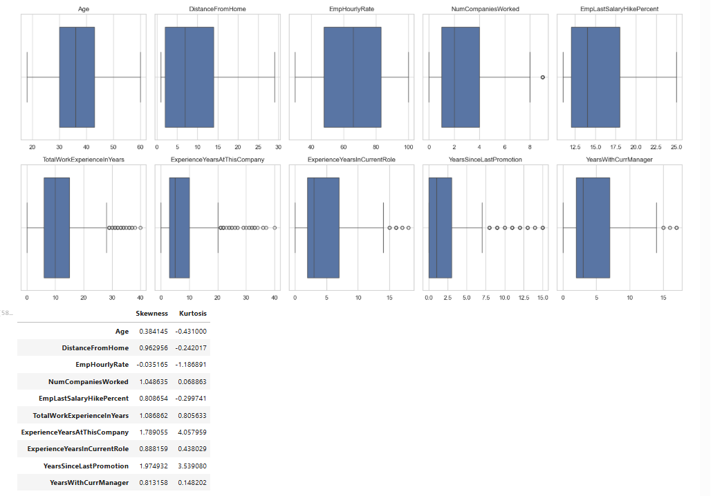
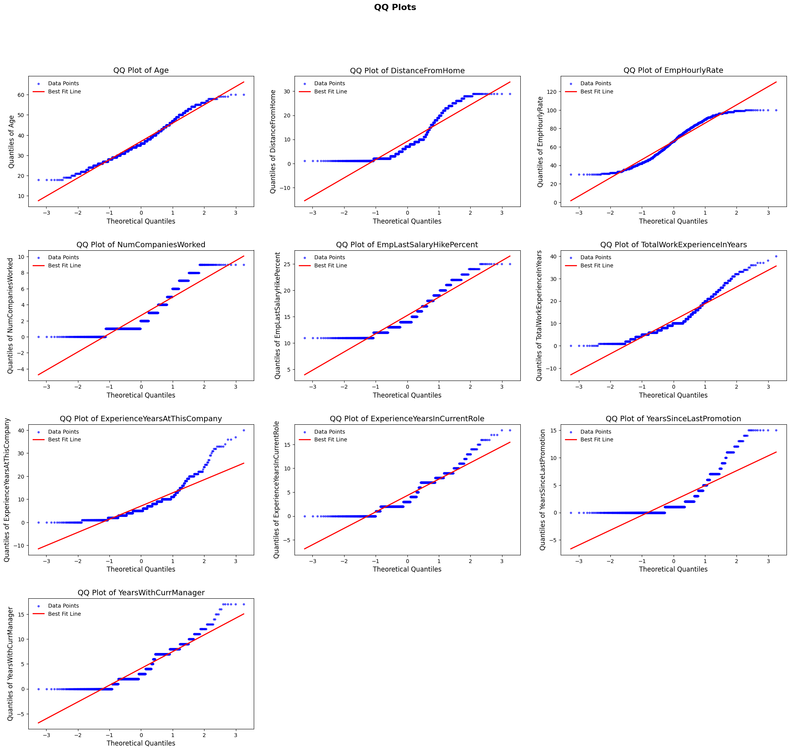
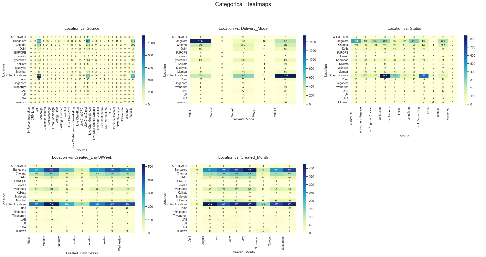
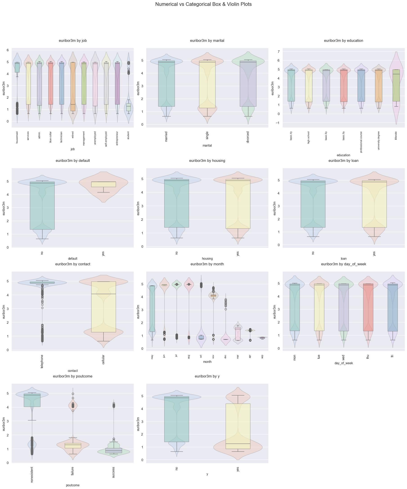
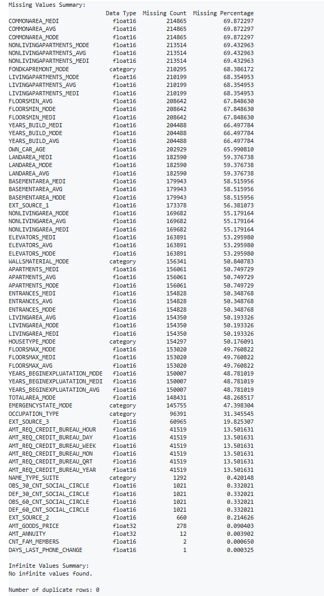
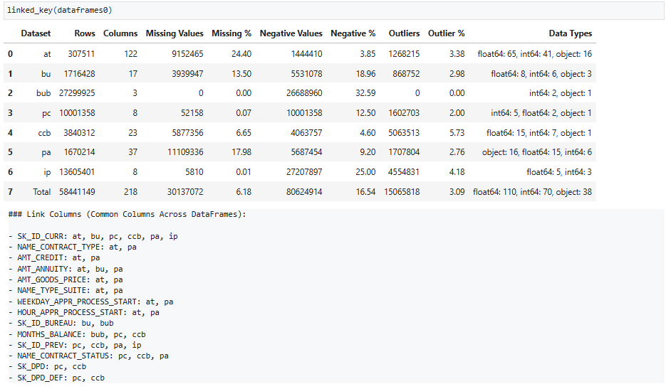
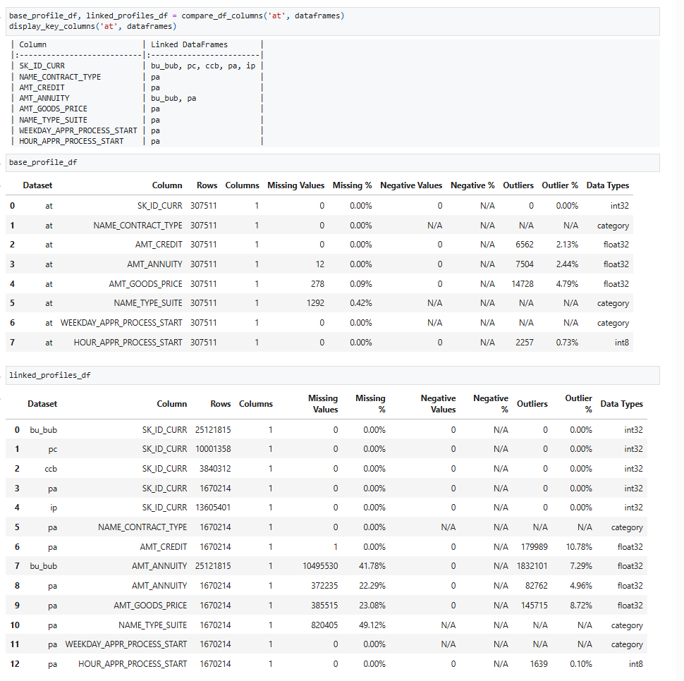

# InsightfulPy Visualization Gallery

> **EDA outputs and visualizations generated by InsightfulPy functions**

---

## Statistical Summary and Data Overview

| Statistical Summary | Dataset Structure Overview |
|:---------------------------------:|:--------------------------:|
|  |  |
| *Combined `num_summary()` and `cat_summary()` outputs with descriptive statistics, skewness, kurtosis, and categorical frequencies* | *Dataset structure analysis with `columns_info()` showing data types, ranges, and distinct counts* |

| Complete Statistical Analysis |
|:-----------------------------:|
|  |
| *statistical summary with numerical analysis (confidence intervals) and categorical analysis (counts and percentages)* |

---

## Distribution Analysis

### Distribution Visualization and Statistical Analysis
| KDE Distribution Plots | Box Plot Analysis | Box Plots with Statistical Measures |
|:----------------------:|:-----------------:|:-----------------------------------:|
|  |  |  |
| *Kernel density plots via `kde_batches()` with histograms, mean, median, mode, and quartiles* | *Box plot analysis using `plot_boxplots()` showing median, quartiles, and outliers* | *Box plots combined with skewness and kurtosis statistical table* |

### Normality Testing
| QQ Plots for Normality Assessment |
|:---------------------------------:|
|  |
| *Quantile-quantile plots comparing data distributions against theoretical normal distributions* |

---

## Categorical Data Analysis

### Categorical Distributions
| Pie Chart Analysis | Bar Chart Analysis | Cross-tabulation Analysis |
|:------------------:|:------------------:|:-------------------------:|
|  |  |  |
| *Pie charts using `cat_pie_chart_batches()` for Gender, Education, MaritalStatus, etc.* | *Bar chart distributions via `cat_bar_batches()` for job, marital, education variables* | *Cross-tabulation between EmpDepartment and PerformanceRating with visualization* |

### Categorical Relationships
| Location-based Categorical Heatmaps | Additional Categorical Heatmaps |
|:-----------------------------------:|:-------------------------------:|
|  |  |
| *Multi-dimensional heatmaps using `cat_vs_cat_pair_batch()` showing Location vs Source, Delivery_Mode, Status, etc.* | *Additional categorical relationship heatmaps for Location-based analysis* |

---

## Advanced Relationship Analysis

### Numerical vs Categorical Relationships
| Box & Violin Plot Analysis |
|:--------------------------:|
|  |
| *Advanced relationship analysis showing euribor3m distribution across categorical variables using box and violin plots* |

---

## Data Quality Assessment

### Missing Value Analysis
| Missing Values Summary (Basic) | Missing Values with Visualizations | Interconnected Outliers |
|:------------------------------:|:-----------------------------------:|:----------------------:|
|  |  |  |
| *Text-based missing values summary using `missing_inf_values()` with percentages* | *Missing values with matrix heatmap and bar chart visualizations using `show_missing()`* | *Cross-column outlier detection using `interconnected_outliers()` showing frequency patterns* |

---

## Multi-Dataset Comparison Tools

### Dataset Comparison and Linking
| Dataset Linking Analysis | Multi-Dataset Detailed Comparison |
|:------------------------:|:----------------------------------:|
|  |  |
| *Dataset linking analysis via `linked_key()` showing overview and common columns* | *Detailed multi-dataset comparison using `compare_df_columns()` with breakdown* |

---

*All visualizations generated using **InsightfulPy v0.2.0** - EDA toolkit for data analysis*

---

Version: 0.2.0 | Status: Beta | Python: 3.8-3.12

Copyright 2025 dhaneshbb | License: MIT | Homepage: https://github.com/dhaneshbb/insightfulpy
